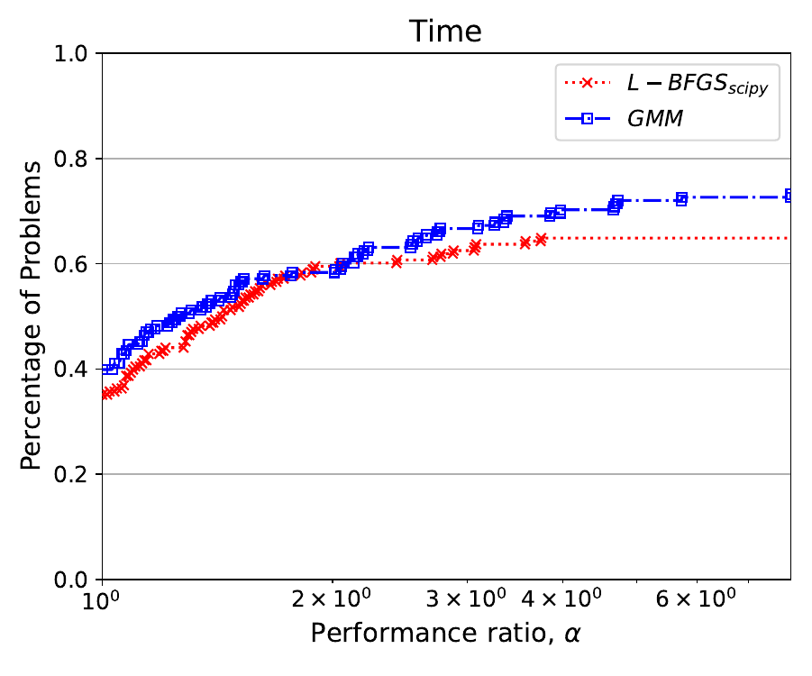
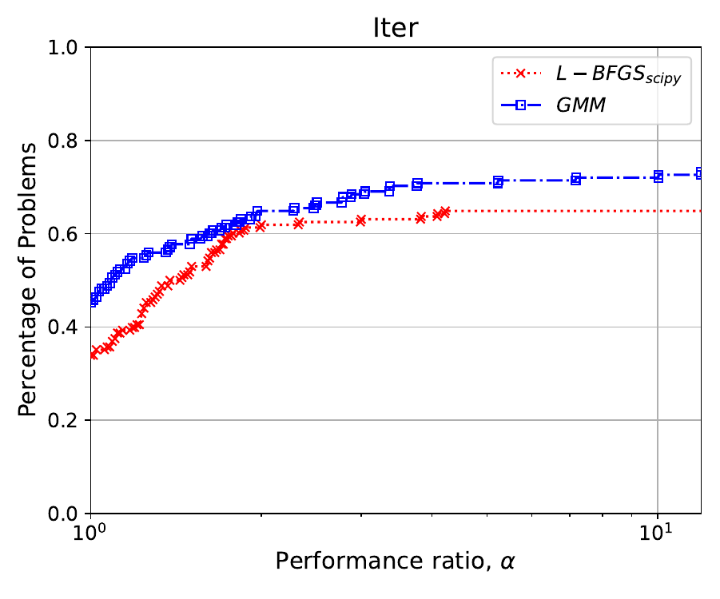

# Gradient Method with Momentum (GMM)
Implementation of a globally convergent gradient method with momentum presented in 

[M. Lapucci, G. Liuzzi, S. Lucidi, D.Pucci and M. Sciandrone - A Globally Convergent Gradient Method with Momentum - arXiv:2403.17613 [math.OC]](https://arxiv.org/abs/2403.17613)

<!-- <p float="left">
  
  
</p> -->

## Installation

A working [Anaconda](https://www.anaconda.com/) installation is required. We suggest the creation of a new conda environment with ```Python 3.11```. All the required packages can be installed with:
```
pip install -r requirements.txt
```
To execute ```CUTEst``` experiments, make sure that the problems are locally [installed](https://jfowkes.github.io/pycutest/_build/html/install.html). We report the ```.SIF``` problem definitions used in the experiment; these correspond to the default ```.SIF``` files downloaded when installing ```CUTEst```.

## Usage
The experiments can be executed using:
```
python main_gmm.py [options]
```
The following arguments shall be specified:

<div align='center'>
  
| Short Option  | Long Option           | Type    | Description                                          | Default           |
|---------------|-----------------------|---------|------------------------------------------------------|-------------------|
| `-p`          | `--problem`    | `str`   | Problem Name               | None (required)   |
| `-g_tol`          | `--grad_tol`           | `float`   | Termination condition on the gradient $\ell_\infty$-norm | `1e-6`   |  
| `-m_iter`         | `--max_iter`      | `float`   | Termination condition on the number of iterations | `100000`   |

</div>


## Acknowledgements

The results  of the experiments reported in Section 7 are avaialble in the `Results` folder. The performance profiles shown in the paper are also avialable in the same folder. We also report the results of ```cg_descent``` executed from ```SuiteOPT```.

In case you employed our code for research purposes, please cite:

```
@misc{lapucci2024globallyconvergentgradientmethod,
      title={A Globally Convergent Gradient Method with Momentum}, 
      author={Matteo Lapucci and Giampaolo Liuzzi and Stefano Lucidi and Davide Pucci and Marco Sciandrone},
      year={2024},
      eprint={2403.17613},
      archivePrefix={arXiv},
      primaryClass={math.OC},
      url={https://arxiv.org/abs/2403.17613}, 
}
```
